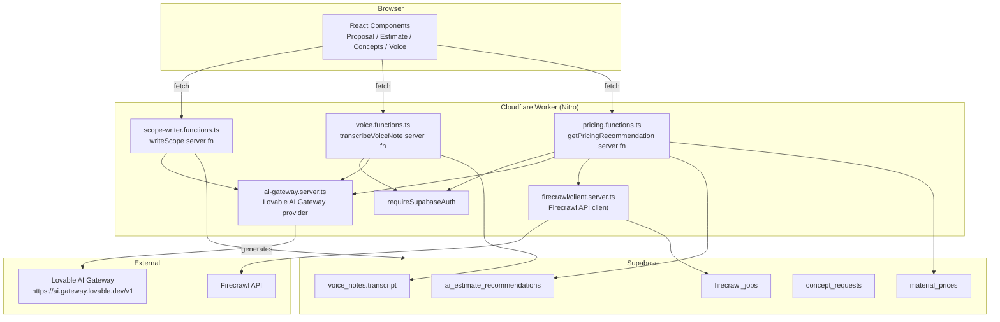

# ManyHats Pro — AI Architecture

> **Version:** V1 Baseline · 2026-07-15  
> Describes all AI capabilities implemented as of the V1 baseline.

---

## AI Philosophy

All AI features in ManyHats Pro follow three principles:

1. **Server-side only** — AI API keys and calls never reach the browser
2. **Advisory, not autonomous** — AI suggestions require human review before affecting client-facing documents
3. **Cached, not live** — AI-generated content (estimates, pricing data) is stored in the database; it does not re-run on every page load

---

## AI Gateway

### Lovable AI Gateway (`src/lib/ai-gateway.server.ts`)

The platform routes all AI calls through the **Lovable AI Gateway**, an OpenAI-compatible proxy that:
- Accepts the `LOVABLE_API_KEY` from environment
- Forwards requests to `https://ai.gateway.lovable.dev/v1`
- Tracks run IDs via `X-Lovable-AIG-Run-ID` headers for debugging
- Is initialized once and reused across calls within a server function

```typescript
// Usage in server functions:
const { createLovableAiGatewayProvider } = await import("./ai-gateway.server");
const gateway = createLovableAiGatewayProvider(process.env.LOVABLE_API_KEY);
const model = gateway("gpt-4o"); // or other models
```

The gateway is built on `@ai-sdk/openai-compatible` (Vercel AI SDK). Any model available on the Lovable gateway can be used.

---

## Implemented AI Features

### 1. AI Proposal Scope Writer

**File:** `src/lib/scope-writer.functions.ts`  
**Route:** Called from `src/components/project/proposal.tsx`  
**Status:** ✅ Implemented

**Input:**
```typescript
{
  rough_notes: string  // Staff's rough notes about the project
  tone: "professional" | "board_ready" | "grant_friendly"
}
```

**Output:** Structured proposal scope with 6 sections:
```typescript
{
  executive_summary: string
  existing_conditions: string
  scope_of_work: string
  recommendation: string
  warranty: string
  exclusions: string
}
```

**Tone modes:**
- `professional` — Standard contractor proposal tone
- `board_ready` — Formal tone for nonprofit board or municipal review
- `grant_friendly` — Emphasizes stewardship, historic value, public benefit, phased stabilization

**Known gap:** Does not use `requireSupabaseAuth` middleware — only validates `LOVABLE_API_KEY`. See `docs/SECURITY.md`.

---

### 2. AI Concept Rendering (Image Generation)

**File:** `src/routes/api/concept-image.ts`  
**Component:** `src/components/project/concepts.tsx`  
**Status:** ✅ Implemented

Generates architectural concept images from:
- Source field photo (uploaded to Storage)
- Text prompt (what changes to make)
- Must-keep list (what to preserve)
- Requested changes (what to transform)

Generated images stored in Supabase Storage `concepts` bucket.  
Staff review: `approved` / `rejected` before proposal inclusion.  
Database: `concept_requests` table with `status` lifecycle.

---

### 3. AI Estimate Recommendations

**File:** `src/lib/firecrawl/pricing.functions.ts` (recommendation endpoints)  
**Component:** `src/components/project/estimate.tsx`  
**Database:** `ai_estimate_recommendations` table  
**Status:** ✅ Implemented (UI with approve/reject buttons)

Flow:
1. Estimate is opened on a project
2. Staff triggers "Get AI Recommendations"
3. AI analyzes project type, site notes, budget range, existing line items
4. Suggestions returned with category, description, quantity, unit price, confidence
5. Each suggestion has `status: pending` until reviewed
6. Staff approves → added to `estimate_line_items`
7. Staff rejects → archived, not used

**Safety:** AI-suggested items never auto-populate estimates. Every line item requires explicit approval.

---

### 4. AI Pricing Recommendation Engine (Firecrawl)

**File:** `src/lib/firecrawl/pricing.functions.ts`  
**Route:** `/pricing` → `src/routes/_authenticated/pricing.tsx`  
**Status:** ✅ Implemented

Two-stage process:

**Stage 1: Firecrawl Data Collection**
```
Firecrawl API → scrape supplier/material pages
→ store in suppliers + materials + material_prices tables
→ price_confidence score (0.0–1.0)
→ source URL + retrieved_at timestamp
```

**Stage 2: AI Price Analysis**
```
material_prices history + supplier data
→ AI analysis via Lovable Gateway
→ pricing recommendation with confidence + reasoning
→ staff reviews before using in estimate
```

Jobs tracked in `firecrawl_jobs` table:
- `supplier_discovery` — find new suppliers
- `material_enrichment` — fetch material specs
- `price_refresh` — update existing prices
- `knowledge_import` — import install guides/specs

All prices stored with: `source`, `retrieved_at`, `product_url`, `price_confidence`. Multiple snapshots preserved (no upsert collapse).

---

### 5. Voice Note Transcription

**File:** `src/lib/voice.functions.ts`  
**Component:** `src/components/project/voice-recorder.tsx`  
**Database:** `voice_notes` table (`audio_path`, `transcript`, `summary`)  
**Status:** ✅ Schema + UI implemented; transcription via server function

Server function uses `requireSupabaseAuth` middleware.  
Transcription: audio file → Lovable AI Gateway speech-to-text model → transcript stored.  
Summary: transcript → AI summary → stored in `voice_notes.summary`.

---

## AI Architecture Diagram



---

## AI Features — Future Roadmap

> These are NOT implemented in V1. They are architectural targets.

| Feature | Description |
|---------|-------------|
| **AI Business Advisor** | Analyzes revenue, margins, project mix, seasonal trends. Recommends actions. |
| **AI Scheduler** | Optimizes job scheduling based on crew availability, material lead times, weather patterns. |
| **AI Site Analysis** | Analyzes field photos + LiDAR data to auto-generate measurement notes and site condition report. |
| **AI Client Assistant** | Answers client questions about their project via the client portal chat. |
| **AI Concept Auto-Generation** | Automatically generates concept renderings when field photos are uploaded (no manual trigger). |
| **Auto Voice Transcription** | Transcribes voice notes immediately on upload without manual trigger. |
| **AI Proposal Personalization** | Adapts proposal tone and content based on client history and project type. |

---

## Data Security for AI Calls

All AI calls follow these rules:

1. API keys (`LOVABLE_API_KEY`, `FIRECRAWL_API_KEY`) are environment variables on the server — never in the browser bundle
2. All AI server functions are loaded via dynamic `import()` inside server handlers — never statically bundled with client code
3. Firecrawl only crawls publicly available pages — no authenticated scraping, no gated content
4. AI-generated content is always labeled (proposal sections, AI recommendations) so staff know it requires review
5. Client-facing documents only contain AI content that has been explicitly approved by staff
