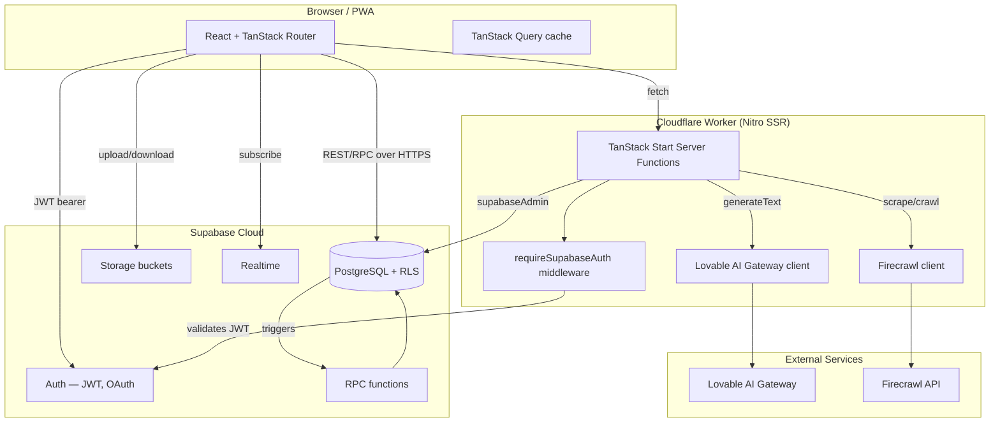
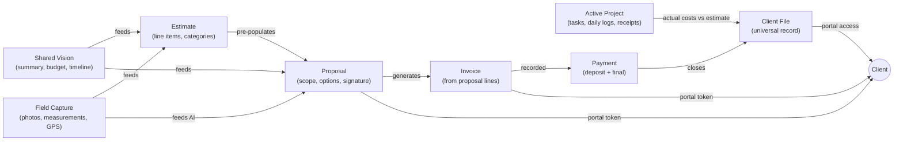
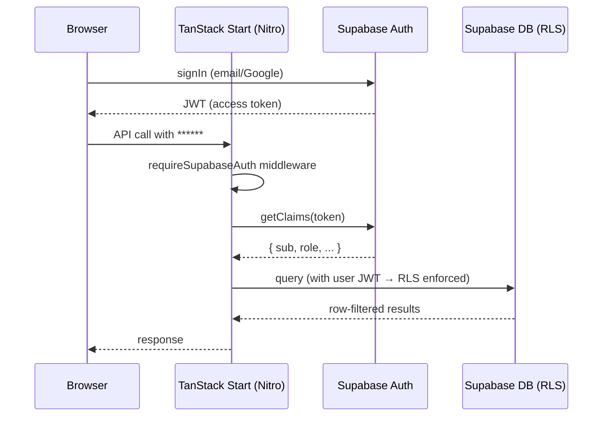

# ManyHats Pro — Platform Architecture V1

> **Version:** V1 Baseline · Frozen 2026-07-15  
> **Status:** Active — this document describes the platform exactly as it exists after the validated restoration merge.  
> Future work extends this architecture; it does not redesign it.

---

## Platform Philosophy

**Capture Once. Use Everywhere.**

Every piece of information collected about a project — from the first client conversation through final payment — flows through a single, connected data spine:

```
Shared Vision
    ↓
Field Capture
    ↓
Estimate
    ↓
Proposal  ──────────────→  Client Portal (view / sign / pay deposit)
    ↓
Active Project
    ↓
Construction (job tasks, daily logs, receipts, change orders)
    ↓
Invoice  ────────────────→  Client Portal (view / pay)
    ↓
Payment
    ↓
Client Relationship (Universal Client File, audit trail)
    ↓
Business Intelligence (profit snapshot, AI recommendations)
```

No data is entered twice. A project summary entered in Shared Vision flows into the proposal scope. Photos taken in Field Capture feed AI concept rendering. Proposal line items pre-populate invoices. The client's portal token gives access to their signed proposal, invoice, and file — all from one link.

---

## Stack Overview

| Layer | Technology |
|-------|-----------|
| Frontend framework | React 19 + TypeScript |
| Build / routing | TanStack Start (TanStack Router + Nitro) |
| Data fetching | TanStack Query v5 |
| UI components | shadcn/ui + Tailwind CSS v4 |
| Hosting / build | Cloudflare Workers (via Nitro cloudflare target) |
| Backend | Supabase (PostgreSQL, Auth, Storage, RPCs) |
| AI | Lovable AI Gateway (OpenAI-compatible proxy) |
| Web scraping | Firecrawl (server-side only) |
| Build config | `@lovable.dev/vite-tanstack-config` v2.7.1 |
| Dev tooling | Bun + Vitest + ESLint + Prettier |

---

## High-Level Architecture Diagram



---

## Directory Structure

```
/
├── src/
│   ├── routes/                        # TanStack Router file-based routes
│   │   ├── __root.tsx                 # App shell, error boundary, providers
│   │   ├── index.tsx                  # Landing page
│   │   ├── auth.tsx                   # Login / signup / invite accept
│   │   ├── reset-password.tsx         # Password recovery
│   │   ├── email-help.tsx             # Support page
│   │   ├── mcp.ts                     # MCP endpoint
│   │   ├── _authenticated/            # Authenticated app routes (staff)
│   │   │   ├── route.tsx              # Auth guard layout
│   │   │   ├── dashboard.tsx
│   │   │   ├── projects.tsx + projects.$id.tsx
│   │   │   ├── clients.tsx + clients.$id.tsx
│   │   │   ├── leads.tsx
│   │   │   ├── estimates.tsx
│   │   │   ├── proposals.tsx
│   │   │   ├── invoices.tsx
│   │   │   ├── payments.tsx
│   │   │   ├── field-capture.tsx + field-capture.$projectId.tsx
│   │   │   ├── pricing.tsx            # Smart pricing / Firecrawl
│   │   │   ├── concept-studio.tsx
│   │   │   ├── job-management.tsx
│   │   │   ├── job-costing.tsx
│   │   │   ├── knowledge-base.tsx
│   │   │   ├── team.tsx
│   │   │   ├── settings.tsx
│   │   │   ├── home-builder.tsx / container-builds.tsx / historic.tsx / septic.tsx
│   │   │   ├── schema-diff.tsx        # Dev tool
│   │   │   └── admin.git-sync.tsx / admin.logs.tsx
│   │   ├── portal.proposal.$token.tsx  # Public proposal portal
│   │   ├── portal.invoice.$token.tsx   # Public invoice portal
│   │   ├── portal.client-file.$token.tsx  # Public client file portal
│   │   └── api/
│   │       ├── concept-image.ts        # AI concept generation API
│   │       └── proposals.$id.pdf.tsx   # PDF generation
│   ├── components/
│   │   ├── project/                   # Project detail tab components
│   │   │   ├── field-capture.tsx
│   │   │   ├── estimate.tsx
│   │   │   ├── proposal.tsx
│   │   │   ├── financial.tsx          # Invoice + payment management
│   │   │   ├── client-file-tab.tsx
│   │   │   ├── concepts.tsx
│   │   │   ├── costing.tsx
│   │   │   ├── job-mgmt.tsx
│   │   │   ├── daily-log.tsx
│   │   │   ├── receipts.tsx
│   │   │   ├── voice-recorder.tsx
│   │   │   └── activity-timeline.tsx
│   │   ├── app-sidebar.tsx
│   │   └── ui/                        # shadcn/ui component library
│   ├── lib/
│   │   ├── manyhats.ts                # Domain constants, enums, helpers
│   │   ├── ai-gateway.server.ts       # Lovable AI Gateway provider factory
│   │   ├── scope-writer.functions.ts  # AI proposal scope writer
│   │   ├── voice.functions.ts         # Voice note transcription
│   │   ├── capture-router.functions.ts  # Field capture routing
│   │   ├── git-sync.functions.ts      # Git sync (admin)
│   │   ├── finance.ts                 # Financial calculation helpers
│   │   ├── firecrawl/
│   │   │   ├── client.server.ts       # Firecrawl API client
│   │   │   └── pricing.functions.ts   # Pricing discovery server functions
│   │   ├── schema-check/              # DB schema drift detection
│   │   └── mcp/                       # MCP tool definitions
│   ├── integrations/
│   │   ├── supabase/
│   │   │   ├── client.ts              # Browser Supabase client (anon key)
│   │   │   ├── client.server.ts       # Server Supabase admin client (service role)
│   │   │   ├── auth-middleware.ts     # requireSupabaseAuth TanStack middleware
│   │   │   ├── auth-attacher.ts       # JWT header attacher for server fn calls
│   │   │   └── types.ts               # Auto-generated Supabase TypeScript types
│   │   └── lovable/
│   │       └── index.ts               # Lovable connector
│   ├── hooks/
│   │   ├── use-auth.ts                # Auth state hook
│   │   └── use-mobile.tsx             # Responsive breakpoint hook
│   ├── routeTree.gen.ts               # Auto-generated TanStack Router tree
│   ├── router.tsx                     # Router factory
│   ├── start.ts                       # Client entry
│   ├── server.ts                      # SSR entry (error wrapper)
│   └── styles.css                     # Global styles + Tailwind
├── supabase/
│   ├── config.toml                    # Supabase project config (project_id)
│   └── migrations/                    # 14 sequential migration files
├── docs/                              # Platform documentation (this directory)
├── public/                            # Static assets, PWA manifest
├── vite.config.ts                     # Lovable Vite config
├── package.json
└── .env                               # SUPABASE_URL, SUPABASE_PUBLISHABLE_KEY (anon)
```

---

## Data Flow — Capture Once, Use Everywhere



---

## Authentication Architecture



See `docs/SECURITY.md` for complete security model.

---

## Related Documentation

| Document | Description |
|----------|-------------|
| [SYSTEM_OVERVIEW.md](./SYSTEM_OVERVIEW.md) | Platform modules and route inventory |
| [DATABASE_SCHEMA.md](./DATABASE_SCHEMA.md) | Complete schema with all 46 tables |
| [SHARED_VISION.md](./SHARED_VISION.md) | Shared Vision data flow and field map |
| [WORKFLOWS.md](./WORKFLOWS.md) | End-to-end workflow diagrams |
| [SECURITY.md](./SECURITY.md) | RLS, auth, tenant isolation |
| [AI_ARCHITECTURE.md](./AI_ARCHITECTURE.md) | AI layer, gateway, server functions |
| [CLIENT_PORTAL.md](./CLIENT_PORTAL.md) | Portal routes, token system, PIN auth |
| [API_REFERENCE.md](./API_REFERENCE.md) | Server functions and RPC reference |
| [EDGE_FUNCTIONS.md](./EDGE_FUNCTIONS.md) | Edge function status (none in V1) |
| [ROADMAP_V1.md](./ROADMAP_V1.md) | Remaining V1 work and priorities |
| [BUILD_STATUS.md](./BUILD_STATUS.md) | Current build/test/lint status |
