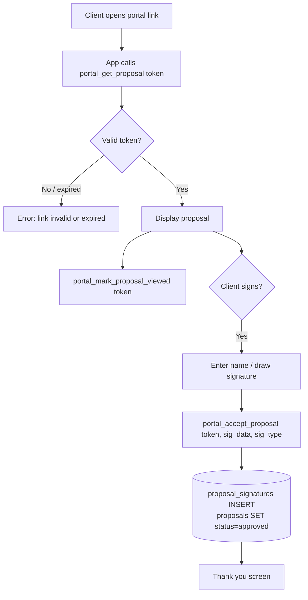
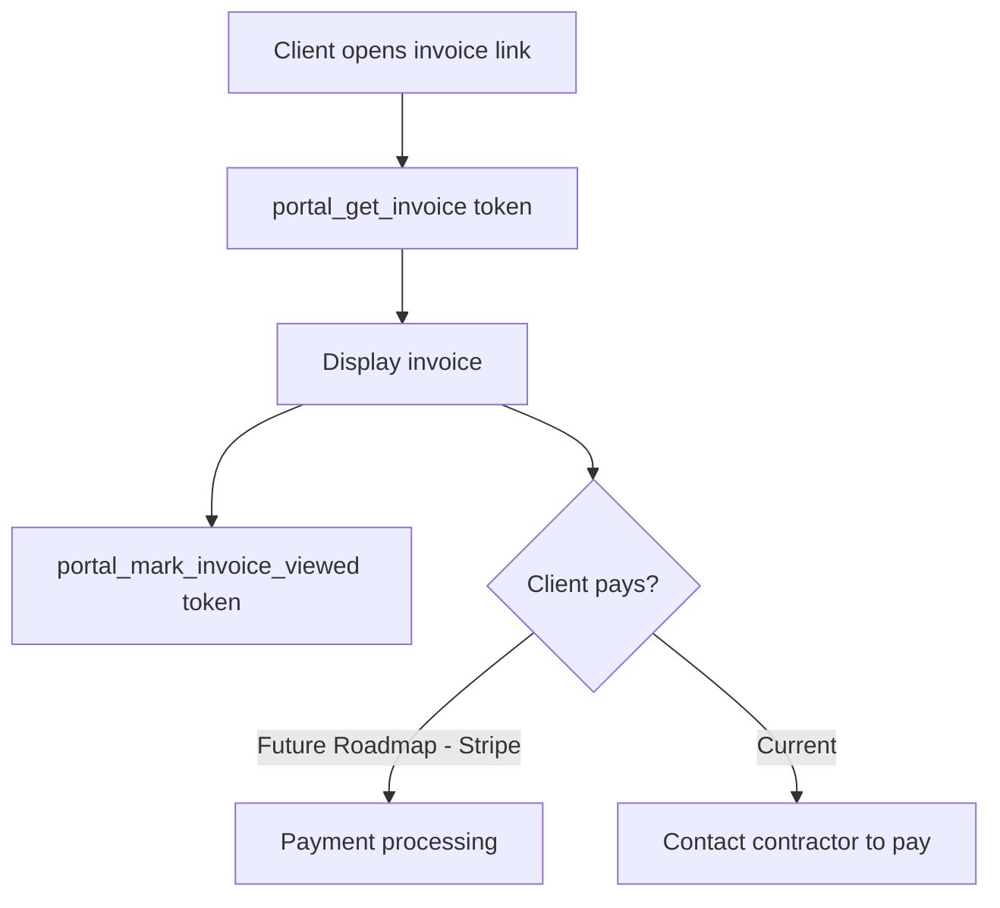
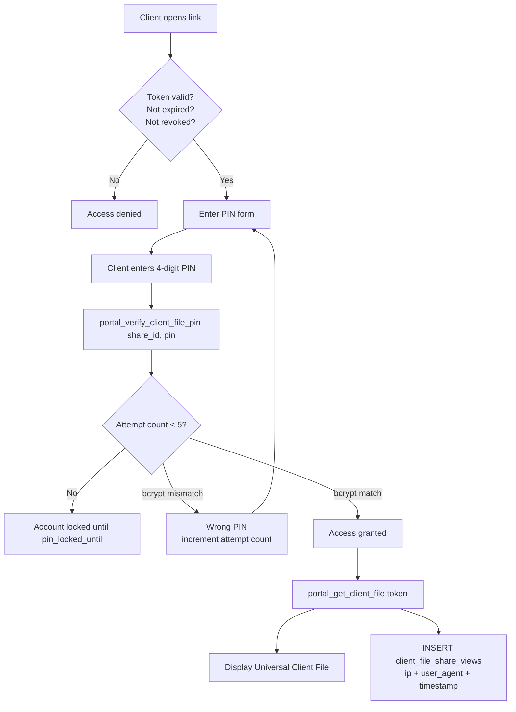

# ManyHats Pro — Client Portal

> **Version:** V1 Baseline · 2026-07-15  
> Documents all three portal routes and the Universal Client File system.

---

## Overview

The Client Portal is the client-facing surface of ManyHats Pro. It allows clients to:

- View and digitally sign their proposal
- View and pay their invoice
- Access their Universal Client File (all project documents in one place)

All portal routes are **public** (no login required) but secured via **token + optional PIN authentication**.

---

## Portal Routes

| Route | File | Auth Method | Purpose |
|-------|------|------------|---------|
| `/portal/proposal/:token` | `portal.proposal.$token.tsx` | URL token | View + sign proposal |
| `/portal/invoice/:token` | `portal.invoice.$token.tsx` | URL token | View + pay invoice |
| `/portal/client-file/:token` | `portal.client-file.$token.tsx` | URL token + email PIN | Universal Client File |

---

## 1. Proposal Portal

**Route:** `/portal/proposal/:token`  
**File:** `src/routes/portal.proposal.$token.tsx`

### Access Flow



### Data Exposed

The `portal_get_proposal(token)` RPC returns:
- Proposal title, scope sections (executive summary, scope of work, etc.)
- Proposal options and pricing
- Project name and client name
- Company branding (ManyHats Construction LLC)

**Not exposed:** Internal cost breakdown, AI draft history, staff notes, estimate line item details, other projects.

### Signature Capture
- Staff can type their name OR draw a signature
- Signature data stored as text or base64 in `proposal_signatures.signature_data`
- Type: `typed` or `drawn`
- `accepted_at` timestamp recorded
- Proposal status updated to `approved` via trigger `on_proposal_signature_insert`

### Token Management
- Generated by `ensure_proposal_portal_token(proposal_id, rotate)` RPC
- Stored in `proposals.portal_token` (UNIQUE)
- Expiry in `proposals.portal_token_expires_at`
- Can be rotated (invalidates old link)

---

## 2. Invoice Portal

**Route:** `/portal/invoice/:token`  
**File:** `src/routes/portal.invoice.$token.tsx`

### Access Flow



### Data Exposed

The `portal_get_invoice(token)` RPC returns:
- Invoice number, date, due date
- Line items with descriptions and amounts
- Subtotal, tax, total, balance due
- Payment status
- Company contact information

### Token Management
- Generated by `ensure_invoice_portal_token(invoice_id, rotate)` RPC
- Stored in `invoices.portal_token` (UNIQUE)
- `sent_at` recorded when invoice is shared
- `viewed_at` recorded by `portal_mark_invoice_viewed`

**Note:** Online payment (Stripe/Paddle) is **Future Roadmap**. V1 displays invoice for client reference; payment is recorded manually by staff.

---

## 3. Client File Portal (Universal Client File)

**Route:** `/portal/client-file/:token`  
**File:** `src/routes/portal.client-file.$token.tsx`

This is the most security-sensitive portal. It aggregates all project documents for the client.

### Two-Factor Access



### PIN Security
- 4-digit PIN generated server-side on share creation
- Stored as bcrypt hash via `pgcrypto.crypt(pin, gen_salt('bf'))`
- Max 5 attempts before lockout (`pin_locked_until`)
- PIN rotation: `rotate_client_file_share_pin(share_id)` — generates new PIN
- Staff sees only the new PIN (not stored in plaintext anywhere after creation)

### Share Lifecycle

| Action | Function | Who Can Call |
|--------|----------|-------------|
| Create | `create_client_file_share(project_id, email, days, include_notes)` | Staff (authenticated) |
| Verify PIN | `portal_verify_client_file_pin(share_id, pin)` | Public (via portal) |
| Read file | `portal_get_client_file(token)` | Public (after PIN verify) |
| Rotate PIN | `rotate_client_file_share_pin(share_id)` | Staff (authenticated) |
| Revoke | `revoke_client_file_share(share_id)` | Staff (authenticated) |

### Data Exposed (when `include_internal_notes = false`)
- Project overview (name, type, status, location)
- Shared Vision summary + site notes + budget range
- All signed proposals
- All invoices and payment status
- Client-facing photos (`is_client_facing = true`)
- Signed contracts and documents

**Not exposed by default:** Internal staff notes, cost breakdowns, AI draft content, receipts, voice notes, daily logs.

When `include_internal_notes = true` (staff choice at share creation): additional project notes may be included.

### Share Metadata
- `recipient_email` — for reference when sending PIN
- `expires_at` — configurable (default set at creation)
- `view_count` — incremented on each access
- `last_viewed_at` — last access time
- `client_file_share_views` — full access log

---

## Staff Management of Portals

From `src/components/project/client-file-tab.tsx`:

1. **Generate share link** — creates token + PIN, displays both to staff
2. **Copy link** — copies portal URL to clipboard
3. **Rotate PIN** — generates new PIN (old access invalidated)
4. **Revoke** — immediately invalidates the share
5. **View access log** — shows all client views with timestamps

From `src/components/project/financial.tsx`:
- Generate invoice portal link
- Copy link for sending to client

From `src/components/project/proposal.tsx`:
- Generate proposal portal link
- Send/copy link for client

---

## Portal Security Summary

```mermaid
graph LR
    subgraph Public["Public Internet"]
        CLIENT[Client Browser]
    end

    subgraph Portal["Portal Routes (Public)"]
        P1["/portal/proposal/:token"]
        P2["/portal/invoice/:token"]
        P3["/portal/client-file/:token"]
    end

    subgraph RPC["Supabase RPCs (SECURITY DEFINER)"]
        R1[portal_get_proposal]
        R2[portal_get_invoice]
        R3[portal_get_client_file + verify_pin]
    end

    subgraph DB["Database"]
        PROP[proposals\n(portal_token)]
        INV[invoices\n(portal_token)]
        CFS[client_file_shares\n(token + pin_hash)]
        LOG[client_file_share_views]
    end

    CLIENT --> P1 --> R1 --> PROP
    CLIENT --> P2 --> R2 --> INV
    CLIENT --> P3 --> R3 --> CFS
    R3 --> LOG
```

All portal RPCs are `SECURITY DEFINER` — they run as the function owner and bypass RLS internally, but only expose the minimum data needed for the portal view. No JWT required for portal access.
