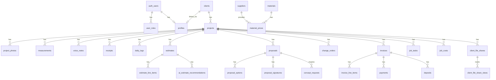

# ManyHats Pro — Database Schema

> **Version:** V1 Baseline · 2026-07-15  
> Source of truth: `supabase/migrations/` (14 migration files)  
> All tables have RLS enabled. All tables include `created_at TIMESTAMPTZ`.

---

## Schema Summary

| Category | Tables |
|----------|--------|
| Auth & Users | `user_roles`, `profiles`, `invitations` |
| CRM | `clients` |
| Projects | `projects`, `project_photos`, `measurements`, `lidar_scans`, `voice_notes`, `receipts`, `daily_logs`, `activity_logs`, `audit_trails` |
| Estimates | `estimates`, `estimate_line_items` |
| Proposals | `proposals`, `proposal_options`, `proposal_signatures` |
| Concepts | `concept_requests` |
| Change Orders | `change_orders` |
| Financial | `invoices`, `invoice_line_items`, `payments`, `deposits`, `progress_billings` |
| Job Management | `job_tasks`, `job_costs`, `material_costs` |
| Specialty | `home_builds`, `container_builds`, `historic_projects`, `septic_projects` |
| Pricing / Firecrawl | `suppliers`, `materials`, `material_prices`, `contractor_service_areas`, `preferred_vendors`, `production_rates`, `firecrawl_jobs` |
| Knowledge | `knowledge_docs`, `knowledge_entries` |
| AI | `ai_estimate_recommendations` |
| Client Portal | `client_file_shares`, `client_file_share_views` |
| System | `notifications`, `error_logs` |

**Total: 46 tables**

---

## Enums

| Enum | Values |
|------|--------|
| `app_role` | `admin`, `crew`, `client` |
| `project_status` | `lead`, `site_visit_scheduled`, `field_capture`, `estimating`, `proposal_draft`, `proposal_sent`, `approved`, `active`, `waiting_on_client`, `waiting_on_materials`, `complete`, `lost` |
| `project_type` | 38 values covering Residential, Site/Civil, Concrete/Masonry, Commercial, Specialty (see `src/lib/manyhats.ts`) |
| `estimate_category` | `labor`, `material`, `equipment`, `subcontractor`, `fuel_travel`, `permit`, `disposal`, `contingency`, `markup`, `other` |
| `proposal_status` | `draft`, `ready`, `sent`, `approved`, `rejected`, `expired` |
| `concept_status` | `draft`, `ready_to_generate`, `generated`, `approved`, `rejected` |
| `invoice_status` | `draft`, `sent`, `partial`, `paid`, `overdue`, `void` |
| `payment_method` | `cash`, `check`, `ach`, `credit_card`, `stripe`, `quickbooks`, `other` |
| `deposit_status` | `pending`, `invoiced`, `paid`, `waived`, `void` |
| `progress_billing_status` | `draft`, `pending_approval`, `approved`, `invoiced`, `paid`, `void` |
| `ai_recommendation_status` | `pending`, `approved`, `rejected` |
| `firecrawl_job_kind` | `supplier_discovery`, `material_enrichment`, `price_refresh`, `knowledge_import` |
| `firecrawl_job_status` | `queued`, `running`, `succeeded`, `failed` |
| `knowledge_doc_kind` | `install`, `spec`, `sds`, `warranty`, `practice`, `safety`, `other` |

---

## Core Tables

### `user_roles`
| Column | Type | Notes |
|--------|------|-------|
| id | UUID PK | |
| user_id | UUID FK → auth.users | ON DELETE CASCADE |
| role | app_role | |
| created_at | TIMESTAMPTZ | |

**RLS:** User can read own roles. Admin can read/write all.

### `profiles`
| Column | Type | Notes |
|--------|------|-------|
| id | UUID PK → auth.users | ON DELETE CASCADE |
| full_name | TEXT | |
| phone | TEXT | |
| company | TEXT | |
| client_id | UUID FK → clients | ON DELETE SET NULL (links staff profile to client record) |
| created_at / updated_at | TIMESTAMPTZ | |

**RLS:** Self or staff can read. Self can update/insert own.

### `clients`
| Column | Type | Notes |
|--------|------|-------|
| id | UUID PK | |
| name | TEXT NOT NULL | |
| email | TEXT | |
| phone | TEXT | |
| address / city / state / zip | TEXT | |
| notes | TEXT | |
| auth_user_id | UUID FK → auth.users | Optional — links to client portal user |
| created_by | UUID FK → auth.users | |
| created_at / updated_at | TIMESTAMPTZ | |

**RLS:** Staff (admin+crew) can do all. Client can read own record (via `auth_user_id`).

### `projects`
| Column | Type | Notes |
|--------|------|-------|
| id | UUID PK | |
| client_id | UUID FK → clients | ON DELETE CASCADE |
| name | TEXT NOT NULL | |
| project_type | project_type | default `other` |
| status | project_status | default `lead` |
| job_address / city / state / zip / county | TEXT | |
| **summary** | TEXT | Shared Vision summary |
| **site_notes** | TEXT | Shared Vision site notes |
| **measurement_notes** | TEXT | Shared Vision measurement notes |
| **budget_min** | NUMERIC | Shared Vision budget range |
| **budget_max** | NUMERIC | Shared Vision budget range |
| **desired_timeline** | TEXT | Shared Vision timeline |
| created_by | UUID FK → auth.users | |
| created_at / updated_at | TIMESTAMPTZ | |

**Indexes:** `client_id`, `status`  
**RLS:** Staff can do all. Client can SELECT own project via `profiles.client_id`.

### `project_photos`
| Column | Type | Notes |
|--------|------|-------|
| id | UUID PK | |
| project_id | UUID FK → projects | |
| storage_path | TEXT NOT NULL | Supabase Storage `field-photos` bucket |
| caption | TEXT | |
| tags | TEXT[] | default `{}` |
| category / phase | TEXT | Field capture metadata |
| is_client_facing / proposal_include | BOOLEAN | Visibility flags |
| gps_lat / gps_lng | NUMERIC(9,6) | GPS coordinates |
| created_by | UUID FK → auth.users | |
| created_at / updated_at | TIMESTAMPTZ | |

### `measurements`
| Column | Type | Notes |
|--------|------|-------|
| id | UUID PK | |
| project_id | UUID FK → projects | |
| label | TEXT NOT NULL | |
| value | NUMERIC NOT NULL | |
| unit | TEXT NOT NULL | |
| file_path | TEXT | LiDAR/scan file path |
| measurement_summary | TEXT | |
| created_by | UUID FK → auth.users | |
| created_at | TIMESTAMPTZ | |

### `voice_notes`
| Column | Type | Notes |
|--------|------|-------|
| id | UUID PK | |
| project_id | UUID FK → projects | |
| client_id | UUID FK → clients | |
| audio_path | TEXT | Supabase Storage |
| transcript | TEXT | AI-generated transcript |
| summary | TEXT | AI summary |
| duration_seconds | INT | |
| category | TEXT | |
| created_by | UUID FK → auth.users | |
| created_at / updated_at | TIMESTAMPTZ | |

### `estimates`
| Column | Type | Notes |
|--------|------|-------|
| id | UUID PK | |
| project_id | UUID FK → projects | |
| title | TEXT NOT NULL | |
| subtotal / tax / total | NUMERIC(12,2) | |
| notes | TEXT | |
| result_summary | JSONB | AI recommendation results |
| created_by | UUID FK → auth.users | |
| created_at / updated_at | TIMESTAMPTZ | |

### `estimate_line_items`
| Column | Type | Notes |
|--------|------|-------|
| id | UUID PK | |
| estimate_id | UUID FK → estimates | ON DELETE CASCADE |
| category | estimate_category | |
| description | TEXT NOT NULL | |
| quantity / unit_price | NUMERIC(12,4) / NUMERIC(12,2) | |
| line_total | NUMERIC(12,2) | |
| notes | TEXT | |
| sort_order | INT | |
| created_at | TIMESTAMPTZ | |

### `proposals`
| Column | Type | Notes |
|--------|------|-------|
| id | UUID PK | |
| project_id | UUID FK → projects | |
| estimate_id | UUID FK → estimates | |
| title | TEXT NOT NULL | |
| status | proposal_status | |
| executive_summary / existing_conditions / scope_of_work / recommendation / warranty / exclusions | TEXT | AI-generated scope sections |
| subtotal / tax / total | NUMERIC | |
| valid_until | DATE | |
| portal_token | TEXT UNIQUE | Client view link token |
| portal_token_expires_at | TIMESTAMPTZ | |
| invoice_id / invoice_number | UUID / TEXT | Link to generated invoice |
| sent_at / viewed_at / accepted_at | TIMESTAMPTZ | Tracking |
| created_by | UUID FK → auth.users | |
| created_at / updated_at | TIMESTAMPTZ | |

### `invoices`
| Column | Type | Notes |
|--------|------|-------|
| id | UUID PK | |
| project_id | UUID FK → projects | |
| proposal_id | UUID FK → proposals | |
| estimate_id | UUID FK → estimates | |
| invoice_number | TEXT UNIQUE NOT NULL | |
| invoice_date | DATE | |
| due_date | DATE | |
| subtotal / tax / total / balance_due | NUMERIC(12,2) | |
| status | invoice_status | |
| portal_token | TEXT UNIQUE | Client view link |
| sent_at / viewed_at | TIMESTAMPTZ | |
| is_final | BOOLEAN | |
| notes | TEXT | |
| created_by | UUID FK → auth.users | |
| created_at / updated_at | TIMESTAMPTZ | |

### `payments`
| Column | Type | Notes |
|--------|------|-------|
| id | UUID PK | |
| project_id | UUID FK → projects | |
| invoice_id | UUID FK → invoices | ON DELETE SET NULL |
| amount | NUMERIC(12,2) NOT NULL | |
| method | payment_method | |
| reference | TEXT | Check number / transaction ID |
| notes | TEXT | |
| paid_at | TIMESTAMPTZ NOT NULL | |
| created_by | UUID FK → auth.users | |
| created_at | TIMESTAMPTZ | |

**Trigger:** `on_payment_insert` → `recalc_invoice_balance()`

### `client_file_shares`
| Column | Type | Notes |
|--------|------|-------|
| id | UUID PK | |
| project_id | UUID FK → projects | |
| token | TEXT UNIQUE NOT NULL | URL token |
| recipient_email | TEXT | |
| pin_hash | TEXT NOT NULL | bcrypt (pgcrypto) |
| pin_verified_at | TIMESTAMPTZ | |
| pin_attempts / pin_locked_until | INT / TIMESTAMPTZ | Brute-force protection |
| expires_at | TIMESTAMPTZ NOT NULL | |
| revoked_at / revoked_by | TIMESTAMPTZ / UUID | |
| view_count / last_viewed_at | INT / TIMESTAMPTZ | |
| include_internal_notes | BOOLEAN | |
| created_by | UUID FK → auth.users | |
| created_at / updated_at | TIMESTAMPTZ | |

---

## Database Functions (RPCs)

| Function | Description | Access |
|----------|-------------|--------|
| `has_role(user_id, role)` | Check if user has specific role | SECURITY DEFINER; not callable by public/anon |
| `is_staff(user_id)` | Check if user is admin or crew | SECURITY DEFINER; not callable by public/anon |
| `handle_new_user()` | Trigger: create profile on auth.users insert | SECURITY DEFINER |
| `set_updated_at()` | Trigger: auto-update updated_at | SECURITY DEFINER |
| `portal_get_proposal(token)` | Public read of proposal by token (no auth) | SECURITY DEFINER; public read |
| `portal_mark_proposal_viewed(token)` | Mark proposal portal as viewed | SECURITY DEFINER |
| `portal_accept_proposal(token, signature, ...)` | Client signs proposal | SECURITY DEFINER |
| `portal_get_invoice(token)` | Public read of invoice by token | SECURITY DEFINER |
| `portal_mark_invoice_viewed(token)` | Mark invoice portal as viewed | SECURITY DEFINER |
| `portal_get_client_file(token, pin?)` | Read client file (PIN-verified) | SECURITY DEFINER |
| `portal_verify_client_file_pin(share_id, pin)` | Verify PIN with attempt tracking | SECURITY DEFINER |
| `create_client_file_share(project_id, email, days, include_notes)` | Create share with bcrypt PIN | SECURITY DEFINER; authenticated |
| `rotate_client_file_share_pin(share_id)` | Generate new PIN | SECURITY DEFINER; authenticated |
| `revoke_client_file_share(share_id)` | Revoke access | SECURITY DEFINER; authenticated |
| `ensure_proposal_portal_token(proposal_id, rotate)` | Ensure/rotate portal token | authenticated |
| `ensure_invoice_portal_token(invoice_id, rotate)` | Ensure/rotate portal token | authenticated |
| `project_profit_snapshot(project_id)` | JSONB: estimated vs approved vs actual costs | SECURITY DEFINER; authenticated |
| `get_public_schema_snapshot()` | Returns live schema JSONB for drift detection | SECURITY DEFINER; authenticated |
| `notify_staff(kind, message, project_id, ...)` | Insert notification | SECURITY DEFINER |
| `on_payment_insert()` | Trigger: recalculate invoice balance | SECURITY DEFINER |
| `on_proposal_signature_insert()` | Trigger: mark proposal approved | SECURITY DEFINER |
| `accept_invitation(token)` | Accept staff invitation | SECURITY DEFINER; authenticated |
| `get_invitation_preview(token)` | Preview invitation (role, email) | SECURITY DEFINER; public |

---

## Storage Buckets

| Bucket | Access | Purpose |
|--------|--------|---------|
| `field-photos` | Staff only (RLS) | Field capture photos, project photos |
| `concepts` | Staff only (RLS) | AI-generated concept images |
| `proposals-pdf` | Staff only (RLS) | Generated proposal PDFs |

---

## Database Relationship Diagram

