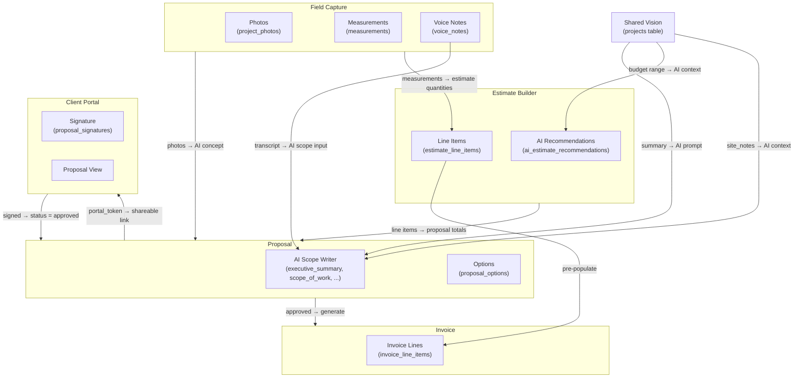

# ManyHats Pro — Shared Vision

> **Version:** V1 Baseline · 2026-07-15  
> Shared Vision is the foundational philosophy and data entry point for ManyHats Pro.

---

## Philosophy: Capture Once. Use Everywhere.

The Shared Vision principle means that every piece of information about a project is entered exactly once and then flows automatically into all downstream documents and systems.

A contractor should never re-type a client's budget into an estimate form after already capturing it in the intake conversation. A scope of work written once should flow into the proposal without being rewritten. Field measurements captured on-site should populate estimate quantities automatically.

---

## What Shared Vision Is

Shared Vision is the project's **north star document** — the convergence of:

- What the **client wants** (summary, inspiration, priorities)
- What the **site provides** (conditions, constraints, measurements)
- What the **budget allows** (range, flexibility)
- What the **timeline requires** (target dates, phasing)

It is not a separate module. It is the **overview tab** of every project — always visible, always editable, always upstream of all other project data.

---

## Shared Vision Fields (V1)

These fields live directly on the `projects` table:

| Field | Column | Description |
|-------|--------|-------------|
| Project summary | `summary` | Client's goals and project description in their words |
| Budget minimum | `budget_min` | Client's stated minimum budget (NUMERIC) |
| Budget maximum | `budget_max` | Client's stated maximum budget (NUMERIC) |
| Desired timeline | `desired_timeline` | Target completion / start date text |
| Site notes | `site_notes` | Site conditions, access, constraints |
| Measurement notes | `measurement_notes` | Key dimensions, areas, special measurements |

**UI location:** `src/routes/_authenticated/projects.$id.tsx` → Overview tab → "Shared vision + site context" card  
**Save mechanism:** `supabase.from("projects").update(...)` — RLS-enforced, staff only  
**Dirty tracking:** The save button is only enabled when any field differs from the loaded data

---

## Information Propagation

---

## Field Capture → Shared Vision Connection

Field Capture is the physical complement to Shared Vision. While Shared Vision captures the *intent*, Field Capture captures the *reality*:

| Shared Vision | Field Capture Complement |
|---------------|------------------------|
| `summary` | Voice notes transcript |
| `site_notes` | Field photos with category="site_condition" |
| `measurement_notes` | Measurements table (label, value, unit) |
| `budget_min/max` | Job costing actual vs estimated |
| `desired_timeline` | Job tasks with scheduled dates |

---

## Proposal Generation from Shared Vision

The AI scope writer (`src/lib/scope-writer.functions.ts`) uses `rough_notes` input to generate:

| Proposal Section | Populated From |
|-----------------|----------------|
| `executive_summary` | AI + project summary from Shared Vision |
| `existing_conditions` | AI + site_notes from Shared Vision |
| `scope_of_work` | AI + measurement_notes + estimate line items |
| `recommendation` | AI analysis |
| `warranty` | AI standard text |
| `exclusions` | AI standard text |

The AI scope writer uses the **Lovable AI Gateway** (server-side only). Tone options: professional, board_ready, grant_friendly.

---

## Estimate Generation from Shared Vision

The AI estimate recommendations flow:

1. Staff opens Estimate tab on project
2. `ai_estimate_recommendations` record created with `pending` status
3. AI analyzes `projects.summary`, `projects.site_notes`, field photos
4. Suggested line items returned (category, description, quantity, unit price)
5. Staff reviews: each suggestion requires explicit **Approve** or **Reject** before it enters `estimate_line_items`
6. AI-suggested items never flow automatically — always advisory

This is a safety design: AI suggestions are advisory; contractor judgment is final.

---

## Client Portal from Shared Vision

When a proposal is ready to share:

1. Staff clicks "Send to Client" in `ProjectProposal`
2. `ensure_proposal_portal_token()` RPC generates a unique token
3. Portal URL: `/portal/proposal/{token}`
4. Client sees: project summary, scope, options, total
5. Client signs digitally → `portal_accept_proposal()` updates `proposal_signatures` and sets proposal status to `approved`
6. Proposal approval triggers invoice generation eligibility

The client never sees internal notes, AI recommendation drafts, or cost breakdowns unless explicitly included.

---

## Universal Client File from Shared Vision

The Universal Client File is the final downstream artifact. It aggregates:

- Project summary (from Shared Vision)
- All proposals (signed)
- All invoices
- All payments
- Change orders
- Key photos (is_client_facing = true)
- Signed contracts

Access: `create_client_file_share()` generates a token + bcrypt PIN. Client receives the link + PIN via email. Access is time-limited, revocable, and audit-trailed.

---

## V1 Limitations

| Limitation | Status |
|-----------|--------|
| No dedicated `shared_vision` table (fields live on `projects`) | By design for V1 |
| No `inspiration` or `client_priorities` columns | Future Roadmap |
| No auto-propagation of summary into proposal text (AI call is manual) | By design — human review required |
| No real-time client collaboration on vision | Future Roadmap |
| Voice note transcription requires manual trigger | Future Roadmap (auto on upload) |
