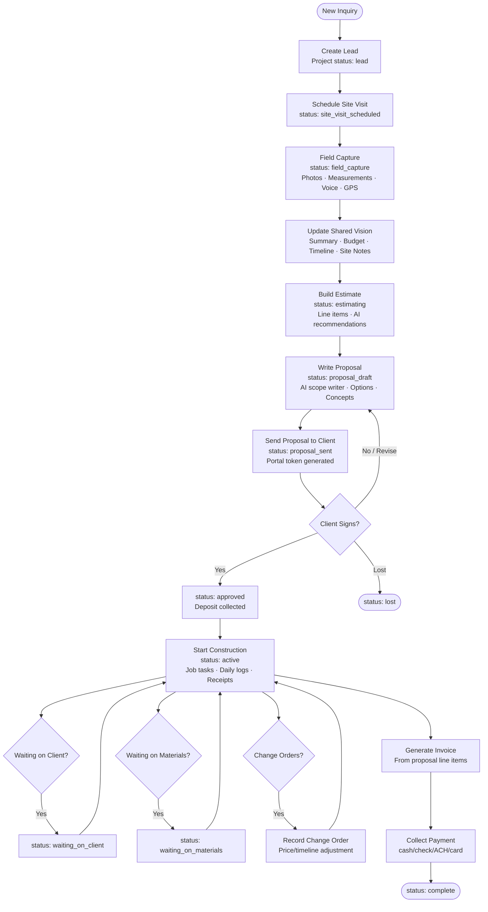
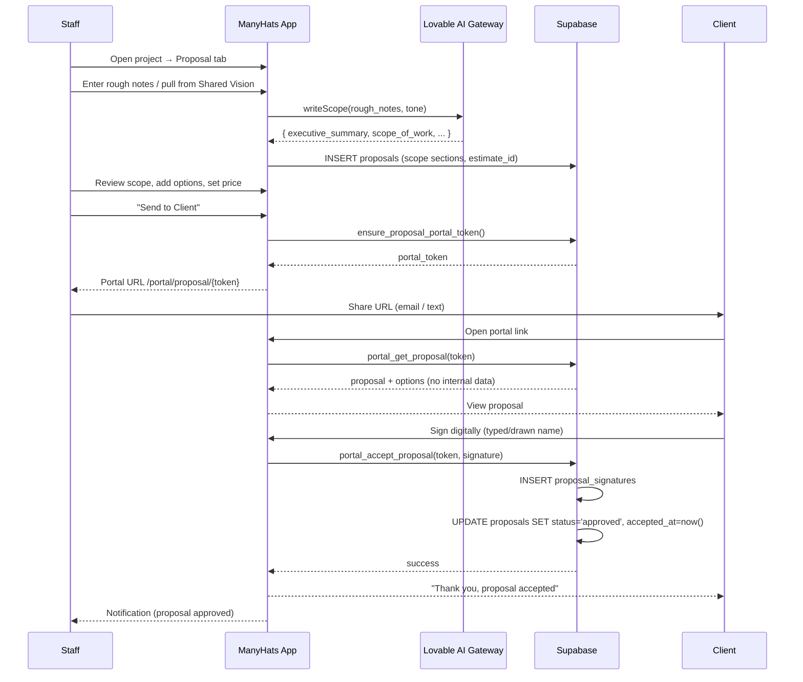
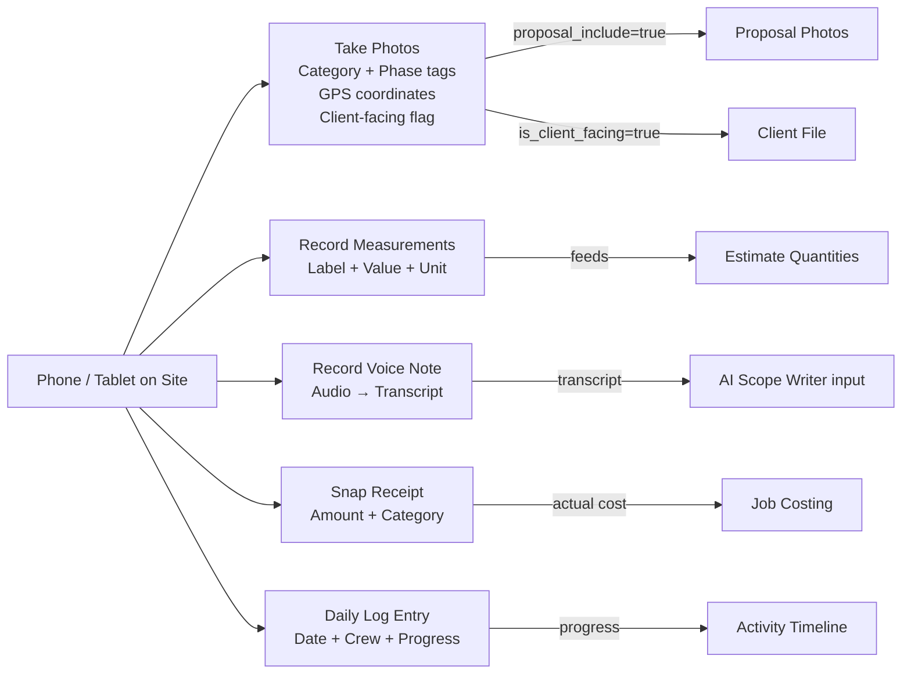
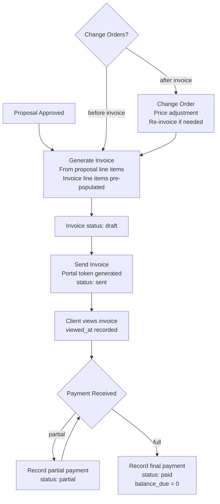
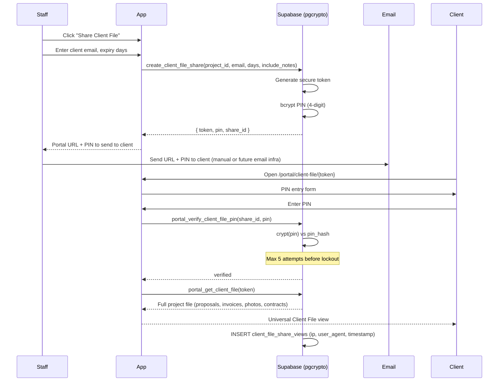
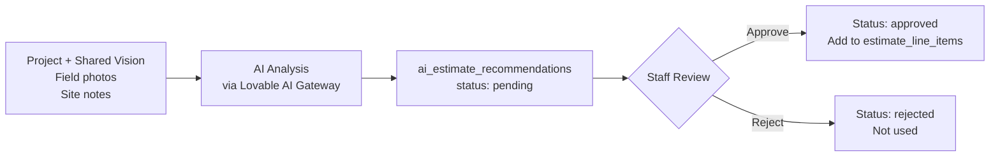
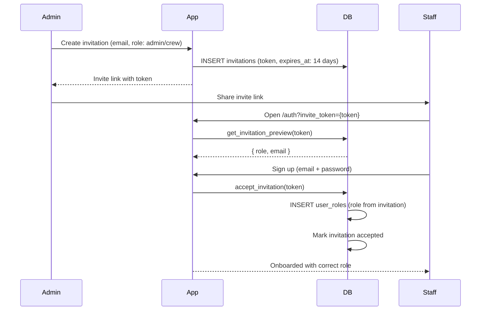

# ManyHats Pro — Workflows

> **Version:** V1 Baseline · 2026-07-15  
> Documents all implemented workflow paths.

---

## Master Workflow: Lead to Payment

---

## Proposal Workflow

---

## Field Capture Workflow

---

## Invoice and Payment Workflow

**Automation:**  
- `on_payment_insert()` trigger calls `recalc_invoice_balance()` on every payment insert
- Invoice `balance_due` is always auto-recalculated

---

## Client File Share Workflow

---

## AI Estimate Recommendation Workflow

**Key principle:** AI suggestions are never automatically added to estimates. Every recommendation requires explicit staff approval. This prevents unreviewed AI suggestions from entering client-facing documents.

---

## Team Invitation Workflow

---

## Change Order Workflow

1. Staff identifies change during construction
2. Opens project → Change Orders (in Job Management tab)
3. Creates change order: description, reason, price change (+ or -), timeline change (days)
4. Change order stored in `change_orders` with `project_id` FK
5. Profit snapshot RPC (`project_profit_snapshot`) includes change orders in revenue calc
6. If change increases price significantly, new invoice generated

---

## Concept Rendering Workflow

1. Staff opens project → Concept tab
2. Creates concept request: title, prompt, source photo, must-keep, requested changes
3. Status: `draft` → `ready_to_generate`
4. Staff triggers generation → AI generates image via `/api/concept-image`
5. Image stored in `concepts` Supabase Storage bucket
6. Status: `generated`
7. Staff reviews: `approved` → can include in proposal (`approved_for_proposal = true`)
8. Status: `rejected` → archived, not used
